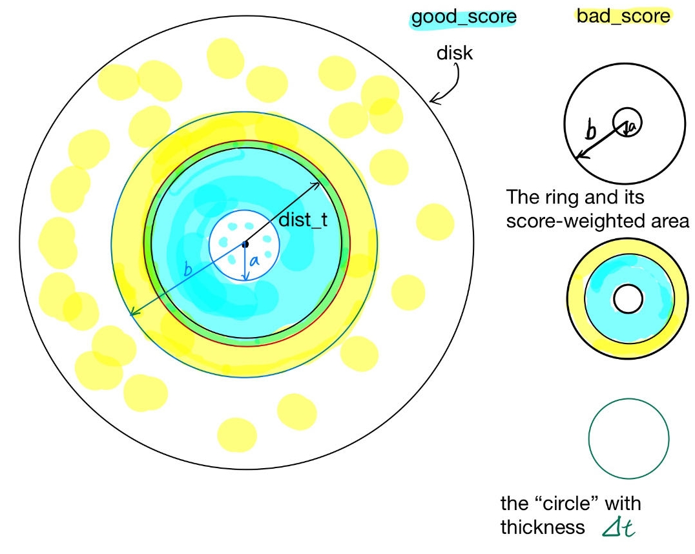

# Reparameterization

This document describes details on the reparameterization, which allow us to use a more general integrand function.

Those 3 properties in Eq.2 in the paper are fundamental to all derivation below.

## Step 1: Boundary Condition

In the previous step, we only consider "very simple" If-Else condition like **if x < t**. We will relax this restriction first. We'd like to handle an integrand in such general form correctly:

```python
def integrand_pd(x: In[float], t: In[float]) -> float:
    if (3.0 * x + 12.4) < (0.5 * t + 5.6):
        return 1.0
    else:
        return 0.0
```

The boundary condition refers to "when does the derivative-of-integral hold nonzero value?" For the simple example, it's **[0 < t < 1]**. Now it becomes a more difficult question for the compiler (us) to answer with some algebraic derivation.

### preprocess

The loma compiler will preprocess such that the condition has the general form `m*x+n > k*t+p`. The original condition written by the user must, for now, follow these rules:

1. the condition itself must be a BinaryOp(), whose op is among `>, >=, <, <=`
2. the lhs expression must have x and be linear in x
3. the rhs expression must have t and be linear in t
4. `m, n, k, p` should not contain `x` and `t`, but can be more complicated expressions other than constant floats.

Besides extracting coefficients, the other goal is to turn the op into **> or >=**.
The compiler will simply negate (add a minus sign) to all 4 coefficients when it sees **< or <=**, which is mathematically equivalent. This saves trouble in the next steps.

And the preprocess task can handle all of the special cases arised when
`m = 1 || k = 1 || n = 0 || p == 0`. This means users can write `if 3.0 * x < t + 5.6` naturally instead of `if (3.0 * x + 0.0) < (1.0 * t + 5.6)`.

### derive the reparameterization in the general form

After preprocess, we only need to consider the indicator integrand of the form `[m*x+n > k*t+p]`, where the 4 coefficients can be any expression independent of **x** and **t**.

We adopt the notation from the paper. Namely, the "continuous expression" inside the indicator is

$$mx-kt+n-p = c(x,t) = R(x)$$

Note that **R(x)** is the same function/expression but emphasizes more on "reparameterziation" and "wrt. x". Also, $\frac{\partial}{\partial t} c(x,t) = -k$ and $\frac{\partial}{\partial x} R(x) = m$

$$ \frac{d}{dt} \int_{a}^{b} [mx + n > kt + p] \,dx $$
$$ = \int_{a}^{b} \frac{d}{dt} [c(x,t) > 0] \,dx $$
$$ = \int_{a}^{b} \delta(c(x,t)) \cdot \frac{\partial}{\partial t} c(x,t)\,dx $$
$$ = -k \int_{a}^{b} \delta(c(x,t)) \,dx $$
$$ = -k \int_{a}^{b} \delta(R(x)) \,dx $$
$$ = - \frac{k}{\frac{\partial}{\partial x} R(x)} \int_{a}^{b} \delta(R(x)) \cdot \frac{\partial}{\partial x} R(x)\,dx $$
$$ = - \frac{k}{m} \int_{R(a)}^{R(b)} \delta(u) \,du $$

We omit the last step which should, according to the third rule of Eq 2 in the paper, turn the integral of Dirac Delta $\delta(u)$ into `[R(a) < 0 < R(b)]`, because there is a caveat. It's legit to assume people will call **IntegralEval()** in the normal order of lower limit and upper limit: **a < b**. But this order no longer holds after they are reparametrized to **R(a)** and **R(b)**.

With our specific setting, when m < 0, **R(x)** is an decreasing function of x and **R(a) > R(b)**. By the Calculus fact $\int_{a}^{b} f(x) \,dx = -\int_{b}^{a} f(x) \,dx$, when m < 0, the integral of Dirac Delta should be `-1 * [R(b) < 0 < R(a)]`

The loma compiler can easily multiply any expression by this **-1**, but couldn't tell the sign of underlying value of **m** because it's only known at runtime (note Rule 4 above). Thus, we have a workaround. We observe that no matter m>0 or m<0, `[m * R(a) < 0 < m * R(a)]` is a correct equivalent indicator. And the extra **-1** can be combined with $\frac{-k}{m}$ by changing it to $\frac{-k}{|m|}$. In this way, the compiler doesn't have to add extra If-Else statement to check the sign of **m** and modify any expressions at runtime.

With this, the final reparameterization result is:

$$\frac{d}{dt} \int_{a}^{b} [mx + n > kt + p] \,dx = -\frac{k}{|m|} [mR(a) < 0 < mR(b)]$$

### step 1 validation

Test code for validating the implementation upto this step can be found in `param_dis_examples\reparam_host.py`

## Step 2: Indicator to General Discontinuous Integrands

Now we come to the easy part. The goal is to compute an integrand function like this:

```python
def integrand_pd(x: In[float], t: In[float]) -> float:
    if (3.0 * x + 12.4) < (0.5 * t + 5.6):
        return -11.0
    else:
        return -1.0
```

We borrow C syntax to better illustrate the differenece. In Step 1, the indicator integrand `[m*x+n > k*t+p]` can also be written as

```c
(m*x+n > k*t+p)? 1.0 : 0.0
```

In this Step 2, it becomes

```c
(m*x+n > k*t+p)? ret_if : ret_else
```

where **ret_if** and **ret_else** are expressions (not necessarily constant numbers) not depending on **x** or **t**.

The key takeaway is that switching from `1.0 : 0.0` to `ret_if : ret_else` doesn't introduce any difference in the boundary condition. Thus, those tedious processing steps for boundary conditions can remain unchanged. It only introduces changes in the final value of integral and its derivative.

The integral value will be computed correctly without changing any code, because again, parametric discontinuities only become a problem after one tries to differentiate the integral.

The derivative of integral value is correct after we multiply the "final reparameterization result" with **(ret_if - ret_else)**. Namely,

$$-\frac{k}{|m|} (ret_{if} - ret_{else}) \cdot [mR(a) < 0 < mR(b)]$$

### proof of correctness

Instead of going through another rigorous algebraic derivation, we'd like to give an informal proof with an example. This could bring more intuitions for understanding the entire problem.

Nevertheless, one must pay special attention when rewriting the general if-else integrand into combination of indicators and applying the product rule. Specifically, `(m*x+n > k*t+p)? ret_if : ret_else` is NOT equivalent to `[m*x+n > k*t+p] * (ret_if - ret_else)`. Doing this will give you wrong integral value. The mathematically equivalent expression is `[m*x+n > k*t+p] * ret_if + [not (m*x+n > k*t+p)] * ret_else`.

Though our implementation only works for 1d integral, we can consider an example where the integral is over some arbitrary domain - let's say a disk on which people throw darts. The disk has 2 regions, and people get different scores depending on whether the dart is within distance **t** to the disk center. We can express this idea with a function like:

```python
def score_integrand_pd(loc_x: In[float], dist_t: In[float]) -> float:
    if loc_x < dist_t:
        # in good region
        return good_score
    else:
        # in bad region
        return bad_score
```

After we inject real meanings to these abstract symbols/expressions, we know the integral, from **loc_x=a** to **loc_x=b** wrt. area measure, represents score-weighted area of a ring with inner radius and outer radius a and b, respectively. Also, note here we use the "simplest" condition that doesn't requires reparameterization. This isolates the changes and difficulties associated to reparameterization.

Now we figure out the meaning of the derivative (wrt. **dist_t**) of the above integral. It represents "how and at what rate does the score-weighted area change if we increase **dist_t** a tiny bit.

And immediately we know that the score-weighted area will not change if the ring is completely inside "good region" or completely inside "bad region".

When this ring overlaps the boundary of good region and bad region, there will be a change. Suppose **dist_t** increases by an infenitesimal value $\varDelta t$, then the score assigned on that infenitesimally thin ring (or we can say circle) goes from bad score to good score. And this difference in score under area measure is exactly the change rate of score-weighted area.

Here is the illustration:



### step 2 validation

Test code for validating the implementation upto this step can be found in `param_dis_examples\more_reparam_host.py`
