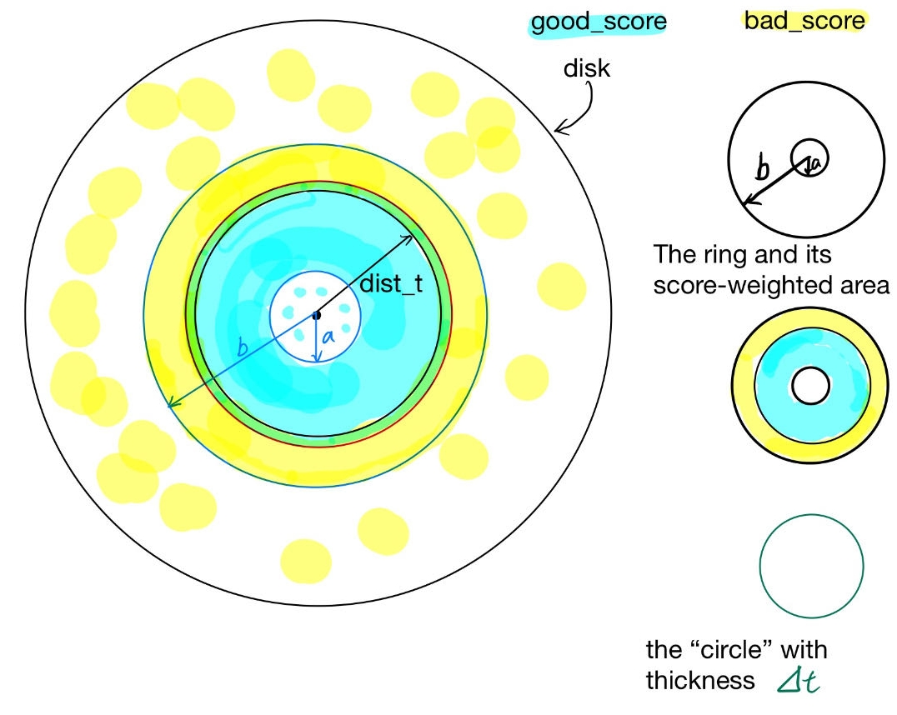

# Project Report: Systematically Differentiating Parametric Discontinuity in Loma

## Introduction

"Systematically differentiating parametric discontinuity" can be translated as "differentiating an integral of if-else (piecewise integrand function) correctly."

The SIGGRAPH paper "Systematically Differentiating Parametric Discontinuity" [Bangaru et al. 2021] provide all ideas, technical details, and rigorous proof of correctness of this project. We will refer it as "the paper" throughout this report. [Teg](https://github.com/ChezJrk/Teg) is their research artifact, a compiler with full features.

The goal of the project is to implement some basic ideas of Teg in [loma](https://github.com/BachiLi/loma_public/), an education compiler with limited language features.

## Choices of Representing Integral in Loma

The first step is to set up loma infrastructure to handle an integral. This means that something like $\int_{x=0}^{\pi/2} cos(x)+5$
should be evaluated to a numerically correct value.

I explored the following options and chose the custom function representation (option 3).

### Option 1: Intermediate Representation (IR)

This means adding something like

```txt
IntegralEval(expr a, expr b, expr integrand, expr wrt)
```

to that super long string in **ir.py**, which defines the ASDL (Abstract-Type and Scheme-Definition Language) grammar and in turn the generated loma grammar. This sounds very promising and is the first option I attempted, I found it very difficult, if not impossible, to implement.
In short, letting Python ADT (Abstract Data Type) to recognize **Integral**, as a new data type is hard.

This part in homework0 write-up could be more explanatory:
> ... loma is embedded in Python. That is, we borrow the Python syntax (but not the semantics), so that we can reuse Python’s parser, and we can exploit on people’s familiarity of Python’s syntax.

Python doesn't have its built-in syntax designed for **Integral**. Unless I did some very fundamental change, inevitably Python parser will treat the **Integral** as a Class or Function. Editing Python library files introduces
difficulties beyond the scope of this final project.

Besides feasibility, adopting this also means loma code needs to be modified a lot, like **irvisitor, type_inference, irmutator**, before we can get **Integral** to work.

### Option 2: Custom Struct

A user-define struct looks like:

```python
class Integral:
    integrand : float
    wrt : float

def eval_integral(a: In[float], b: In[float], integral: In[Integral]) -> float:
    # implementation
```

It has several issues:

- No matter how restricted our *Integral* is (1d, float only, etc.), the integrand must be a **loma_ir.expr** instead of **loma_ir.Var**. In other words, we shouldn't only support $\int_{x=0}^{\pi/2} x$. Something as simple as $\int_{x=0}^{\pi/2} cos(x)+5$ must be supported at least. And this posts serious questions on how to represent **integrand** or what type it should be. Using **float** is wrong, as just explained. Mathematically, the integrand (for 1d at least) should actually be a function *f(x)*
- A loma Struct (**Class Integral** in the above python syntax) can only have data members but not member functions. This is a language-specific limitation, and it limits us to give "function property" to the **integrand** member.
- Think one step ahead, after the Integral infrastructure has been set, we take derivative. But what is the meaning of a differential struct, class **_dIntegral**? What about its "diff type" members? Doesn't really make sense.

### Option 3: Custom Function

To be fair, in terms of conciseness, custom function is better, but not by too much, than custom struct. We still need something like:

```python
def integrand_f(x: In[float]) -> float:
    return 4*sin(x) + 5

# "fake" MC integral eval
# samples are not random, but 0.1 apart
def IntegralEval(lower: In[float], upper: In[float]) -> float:
    curr_x: float = lower
    n: int = (upper - lower) / 0.1 + 1
    i: int = 0
    res: float = 0.0
    while (i < n, max_iter := 100):
        res = res + integrand_f(curr_x)
        i = i + 1
        curr_x = curr_x + 0.1
    res = res * (upper - lower) / n
    return res
```

Note that loma users need to define N copies of **integrand_f()** and its
corresponding **IntegralEval()** if they
need to evaluate integral on N different functions, and this is a common case.

Using a universal **IntegralEval()** for all user-defined integrand functions is not feasible, because loma doesn't support function as argument and enabling it will introduce too much work.

The biggest advantage is the ease of compiler implementation. Everything is built by existing loma features. Or we can say difficulties in compiler design are turned into user overhead of writing more code:

- Define a function for each integrand.
- ~~Copy the **IntegralEval()** definition once for every program they write.~~

which is arguably not too bad.

Even better, later we managed to let the compiler to automatically generate those integral evaluation functions. This means when users define an **integrand_f**, they can use its evaluation function **eval_f** directly.
For more details on this part, [see this section](#compiler-generated-integral-eval-code).

## System Design: Handle Parametric Discontinuity

This section provides system design ideas of handling parametric discontinuity.

At this step, we only consider the simplest indicator integrand, namely
$f(x) = [x < t]$.

### Notations

Each concept could have more than one name/alias and notation/symbol across different places. We provide a reference list first before discussing technical details.

- integrand: $f(x), f(x, t), [x < t]$
- integral: $\int_{x=a}^{b} f(x)$
- primal value: val, the integral; the numerical evaluation of the integral above
- derivative: dval, derivative-of-integral; the numerical evaluation of $\frac{d}{dt} \int_{x=a}^{b} f(x)$, note that we differentiate wrt. the parameter $t$ instead of variable $x$.
- lower integration limit: a, lower
- upper integration limit: b, upper
- interval: [lower, upper], [a, b]
- integration variable: $x$, $dx$
- (discontinuous) parameter: $t$
- parametric discontinuity: pd, PD, if-else
- simplest indicator integrand: $[x \lt t]$, `(x<t)? 1.0 : 0.0`
- indicator integrand: $[mx+n \gt kt+p]$, `(mx+n > kt+p)? 1.0 : 0.0`; here $m, n, k, p$ are assumed to be constants.
- general PD integrand: `(mx+n > kt+p)? then_value : else_value`

### Goal

Related files are

- driver code: [ind_host.py](../param_dis_examples/ind_host.py)
- loma code: [ind.py](../param_dis_examples/loma_code/ind.py)

We want to compute $\frac{d}{dt} \int_{x=a}^{b} [x \lt t]$, which
should be evaluated to $[a < 0 < b]$. See the paper for details.

Using the setup in the driver code ($a=5, b=7$), we expect

```shell
# output from the driver code
With t=4.0, IntegralEval(5.0, 7.0, [x<t], t) gives result 0.000 and derivative 0.000
With t=5.5, IntegralEval(5.0, 7.0, [x<t], t) gives result 0.498 and derivative 1.000
With t=8.0, IntegralEval(5.0, 7.0, [x<t], t) gives result 2.000 and derivative 0.000
```

### Assumptions

Here are some assumptions we made at the current stage. We will relax some of them later, after we have reparameterization to handle general PD integrand.

- Everything in float type
- Single variable (1D) integral
- Derivatives won't be taken wrt. lower and upper. These 2 are assumed to be constant floats chosen by the user. In practice, loma will compute them, but we don't guarantee the correctness.
- There will only be "simple" if-else condition. This means we only consider **if x < t** but not **if (2x-5) > (7-3t)**. General conditions will be resolved by reparameterization, the next step of the project.
- Both if clause and else clause will only have a single return statement.
- The returned value from else clause is 0.0, otherwise the integrand is no longer an indicator function. This will also be addressed after we have reparameterization.
- Only forward mode is considered.

### Design

#### integral eval caller

First, the **IntegralEval** function will be renamed moved to the compiler [later](#compiler-generated-integral-eval-code). For now, we still make it user-generated for more explicitness. It's a
general-purpose caller that evaluates the integral, nothing special than a Riemann Sum that places samples evenly in [a, b].

```python
def IntegralEval(lower: In[float], upper: In[float], t: In[float]) -> float:
    curr_x: float = lower
    n: int = (upper - lower) / 0.01 + 1
    i: int = 0
    res: float = 0.0
    while (i < n, max_iter := 1000):
        res = res + integrand_pd(curr_x, t)
        i = i + 1
        curr_x = curr_x + 0.01
    res = res * (upper - lower) / n
    return res
```

After being prepended to the actual user code, its forward-diff version will be derived by the loma auto-diff pipeline.

#### integrands

With our integral representation design, users will define the integrands themselves (there could be many). $f(x, t) = [x < t]$ will look like

```python
def integrand_pd(x: In[float], t: In[float]) -> float:
    if x < t:
        return 1.0
    else:
        return 0.0
```

When the integrand doesn't have a discontinuous parameter (no if-else), there isn't any special treatment. The integrand is just a custom function call. See [simple_d_integral.py](../param_dis_examples/loma_code/simple_d_integral.py) and [its driver code](../param_dis_examples/simple_d_integral_host.py)

When there is a discontinuity, however, we need 2 things:

1. In the fwd-diff version of caller **IntegralEval**, `integrand_pd(curr_x, t)` will be turned to `_d_fwd_integrand_pd(curr_x,t,lower,upper)`
2. When differentiating the integrand, we manually construct the code such that it computes both val and dval correctly. This will be explained in more details below.

We use a hack to determine if there is a discontinuity: check whether the integrand has both "integrand" and "pd" in its name. Admittedly, this isn't an elegant solution, but it's easier to implement than other means, like function decorator.

### Manual Construction of the Integrand

This is the fwd-diff version of the above **integrand_pd** function, which should be 90% self-explanatory:

```python
def _d_fwd_integrand_pd(x : In[_dfloat], t : In[_dfloat], lower : In[_dfloat], upper : In[_dfloat]) -> _dfloat:
        correct_val : float
        if ((x).val) < ((t).val):
                correct_val = (float)(1.0)
        else:
                correct_val = (float)(0.0)
        correct_dval : float
        if (((lower).val) < ((t).val)) && (((t).val) < ((upper).val)):
                correct_dval = ((float)(1.0)) / (((upper).val) - ((lower).val))
        else:
                correct_dval = (float)(0.0)
        return make__dfloat(correct_val,correct_dval)
```

The only thing worth notice is the `correct_dval = 1.0 / (upper.val - lower.val)` instead of `correct_dval = 1.0`.

The high-level idea is, the derivative of an indicator function is a Dirac Delta, which is non-trivial to represent or handle
in the existing loma infrastructure. Fortunately, Dirac Delta is only a by-product under our "differentiate then discretize/integrate" framework. We integrate this Dirac Delta signal over $x$ and get the **[lower < t < upper]**.

Thus, we aim to produce the correct final result **[lower < t < upper]** only.
Geometrically, a 1D Dirac Delta signal is a rectangle infinitesimally thin and infinitely tall, but has area-under-curve 1. Under the current "simple" condition without reparameterization, it's equivalent to the area of a rectangle with width=`(upper-lower)` and height=`1/(upper-lower)`. Due to the Riemann Sum nature of our integral evaluation, the "height" in the code becomes `correct_dval = 1.0 / (upper.val - lower.val)`.

## Reparameterization

This document describes details on the reparameterization, which allow users to use general PD integrands.

Those 3 properties in Eq.2 in the paper are fundamental to all derivation below.

### Step 1: Boundary Condition

In the previous section, we only consider simplest indicator integrand. We will enable general-form indicators first, which look like:

```python
def integrand_pd(x: In[float], t: In[float]) -> float:
    if (3.0 * x + 12.4) < (0.5 * t + 5.6):
        return 1.0
    else:
        return 0.0
```

The boundary condition refers to "when does the derivative-of-integral hold nonzero value"? For the simple example, it's **[0 < t < 1]**. Now it becomes a more difficult question that requires some algebraic derivation for the compiler (us) to answer.

#### preprocess

The loma compiler will preprocess such that the condition has the general form $mx+n > kt+p$. The original condition written by the user must follow these rules:

1. the condition itself must be a **BinaryOp()**, whose **op** is among `>, >=, <, <=`
2. the lhs expression must have x and be linear in x
3. the rhs expression must have t and be linear in t
4. `m, n, k, p` should not contain `x` or `t`, but can be more complicated expressions other than constant floats.

Besides extracting coefficients, the other goal is to turn the op into **> or >=**.
The compiler will simply negate (add a minus sign) to all 4 coefficients when it sees **< or <=**, which is mathematically equivalent. This saves trouble in the next steps.

And the preprocess task can handle all the special cases when
`m = 1 || k = 1 || n = 0 || p == 0`. This means users can write `if 3.0 * x < t + 5.6` naturally instead of `if (3.0 * x + 0.0) < (1.0 * t + 5.6)`.

#### derive the reparameterization in the general form

After preprocess, we only need to consider the indicator integrand of the form $mx+n > kt+p$, where the 4 coefficients can be any expression independent of **x** and **t**.

We adopt the notation from the paper. Namely, the "continuous expression" inside the indicator is

$$mx-kt+n-p = c(x,t) = R(x)$$

Note that **R(x)** is the same function/expression but emphasizes more on "reparameterziation" and "wrt. x". Also, $\frac{\partial}{\partial t} c(x,t) = -k$ and $\frac{\partial}{\partial x} R(x) = m$

$$ \frac{d}{dt} \int_{a}^{b} [mx + n > kt + p] \,dx \\
= \int_{a}^{b} \frac{d}{dt} [c(x,t) > 0] \,dx \\
= \int_{a}^{b} \delta(c(x,t)) \cdot \frac{\partial}{\partial t} c(x,t)\,dx \\
= -k \int_{a}^{b} \delta(c(x,t)) \,dx \\
= -k \int_{a}^{b} \delta(R(x)) \,dx \\
= - \frac{k}{\frac{\partial}{\partial x} R(x)} \int_{a}^{b} \delta(R(x)) \cdot \frac{\partial}{\partial x} R(x)\,dx \\
= - \frac{k}{m} \int_{R(a)}^{R(b)} \delta(u) \,du $$

We omit the last step which should, according to the third rule of Eq 2 in the paper, turn the integral of Dirac Delta $\delta(u)$ into `[R(a) < 0 < R(b)]`, because there is a caveat. It's legit to assume users will call **IntegralEval()** in the normal order of lower limit and upper limit: **a < b**. But this order no longer holds after they are reparametrized to **R(a)** and **R(b)**.

With our specific setting, when $m < 0$, **R(x)** is a decreasing function of x and **R(a) > R(b)**. By the Calculus fact $\int_{a}^{b} f(x) \,dx = -\int_{b}^{a} f(x) \,dx$, when $m < 0$, the integral of Dirac Delta should be `-1 * [R(b) < 0 < R(a)]`

The loma compiler can easily multiply any expression by this **-1**, but it couldn't tell the sign of underlying value of **m** because it's only known at runtime (note Rule No.4 above). Thus, we have a workaround.

We observe that no matter $m>0$ or $m<0$, `[m * R(a) < 0 < m * R(a)]` is a correct equivalent indicator. And the extra **-1** can be combined with $\frac{-k}{m}$ by changing it to $\frac{-k}{|m|}$, because it should be $(m > 0)? \frac{-k}{m} : \frac{-k}{-m}$. In this way, the compiler doesn't have to add extra if-else statement to check the sign of **m** and modify any expressions at runtime.

With this, the final reparameterization result is:

$$\frac{d}{dt} \int_{a}^{b} [mx + n > kt + p] \,dx = -\frac{k}{|m|} [mR(a) < 0 < mR(b)]$$

### validation of Step 1

Test code for validating the implementation upto this step can be found in [reparam.py](../param_dis_examples/loma_code/reparam.py) and its [driver code](../param_dis_examples/reparam_host.py)

### Step 2: Indicator to General Discontinuous Integrands

Now we come to the easy part. The goal is to compute a general PD integrand function like this:

```python
def integrand_pd(x: In[float], t: In[float]) -> float:
    if (3.0 * x + 12.4) < (0.5 * t + 5.6):
        return -11.0
    else:
        return -1.0
```

We borrow C syntax to better illustrate the differenece. In Step 1, the indicator integrand $[mx+n > kt+p]$ can also be written as

```c
(m*x+n > k*t+p)? 1.0 : 0.0
```

In this Step 2, it becomes

```c
(m*x+n > k*t+p)? ret_if : ret_else
```

where **ret_if** and **ret_else** are expressions (not necessarily constant numbers) not depending on **x** or **t**.

The key takeaway is that switching from `1.0 : 0.0` to `ret_if : ret_else` doesn't introduce any difference in the boundary condition. Thus, those tedious processing and derivation steps for boundary conditions can remain unchanged. It only introduces changes in the final value of integral and its derivative.

The integral value will be computed correctly without any code change, because again, parametric discontinuities only become a problem after one tries to differentiate the integral.

The derivative of integral value is correct after we multiply the "final reparameterization result" with **(ret_if - ret_else)**. Namely,

$$-\frac{k}{|m|} (ret_{if} - ret_{else}) \cdot [mR(a) < 0 < mR(b)]$$

#### motivating example

Instead of going through another rigorous algebraic derivation, we'd like to give an informal proof with an example. This could bring more intuitions for understanding the entire problem.

Nevertheless, one must pay special attention when rewriting the general if-else integrand into combination of indicators and applying the product rule. Specifically, `(m*x+n > k*t+p)? ret_if : ret_else` is NOT equivalent to `[m*x+n > k*t+p] * (ret_if - ret_else)`. Doing this will give you wrong integral value. The mathematically equivalent expression is `[m*x+n > k*t+p] * ret_if + ![(m*x+n > k*t+p)] * ret_else`.

Though our implementation only works for 1d integral, we can consider an example where the integral is over some arbitrary domain - let's say a dartboard on which people throw darts. The dartboard has 2 regions, and people get different scores depending on whether the dart is within distance **t** to the dartboard center. We can express this idea with a function like:

```python
def score_integrand_pd(loc_x: In[float], dist_t: In[float]) -> float:
    if loc_x < dist_t:
        # in good region
        return good_score
    else:
        # in bad region
        return bad_score
```

After we inject real meanings to these abstract symbols/expressions, we know the integral, from **loc_x=a** to **loc_x=b** wrt. area measure, represents score-weighted area of a ring with inner radius and outer radius a and b, respectively. Also, note here we use the "simplest" condition that doesn't require reparameterization. This isolates the changes and difficulties associated to reparameterization.

Now we figure out the meaning of the derivative-of-integral (wrt. **dist_t**) of the above function. It represents "how and at what rate does the score-weighted radius change if we increase **dist_t** a tiny bit?"
Then score-weighted area is simply score-weighted radius multiplied with $2\pi$.

$$\text{Area of a circle} =\pi R^2 = 2\pi \int_{x=0}^{R} x$$

Also, we know that the score-weighted area will not change if the ring (with inner radius $a$ and outer radius $b$) is completely inside "good region" or "bad region".

When this ring overlaps the boundary of good region and bad region, however, there will be a change. Suppose **dist_t** increases by an infenitesimal value $\varDelta t$, then the score assigned on that infenitesimally thin ring (or we can say circle) goes from bad score to good score. And this difference in score under area measure is exactly the change rate of score-weighted area.

Here is the illustration:



#### validation of Step 2

Test code for validating the implementation upto this step can be found in [more_reparam.py](../param_dis_examples/loma_code/more_reparam.py) and its [driver code](../param_dis_examples/more_reparam_host.py)

## Compiler-generated Integral Eval Code

After everything is correctly implemented, we rename the **IntegralEval()** function and move it to the compiler. This means when users defines an integrand called **integrand_pd_f1()**, they can directly call **eval_pd_f1()**. The renaming simply takes the integrand function name and replaces "integrand" with "eval".

The implementation of this part isn't difficult. We just translate loma code to compiler code that constructs a `FunctionDef` IR.

Note that users still need to define the forward auto-diff version of the integral evaluation with `fwd_eval_pd_f1 = fwd_diff(eval_pd_f1)`, if they ever need to call the auto-diff integral evaluation directly.

Test code for validating the implementation upto this step can be found in [no_eval.py](../param_dis_examples/loma_code/no_eval.py) and its [driver code](../param_dis_examples/no_eval_host.py)

## Program and Visualize the Motivating Example

Finally, we setup a toy optimation problem of the above [motivating example](#motivating-example).

To minimize the confusion, we set **a** and **b** in the above disuccsion to **0.0** and a fixed **RADIUS=6.0** respectively. This means "the ring" is the dartboard itself. The optimization goal is to find the **dist_t** that make score-weighted outer area equal to score-weighted inner area. We will call them "bad area" and "good area".

The loma code and application code are in [dartboard.py](../param_dis_examples/loma_code/dartboard.py) and [dartboard_host.py](../param_dis_examples/dartboard_host.py).

In the loma code, the function **good_bad_diff** computes (good area - bad area) using the given $t$. Its auto-diff function **fwd_good_bad_diff** computes the $dt$ to update $t$ in the gradient descent optimization in the application code.

The visualization can be found in [dartboard.mp4](../param_dis_examples/dartboard.mp4)

### failed attempt on a more interesting application

We have attempted implementing those applications mentioned in the paper. The difficulty is one problem, but the bigger problem is there provided application code couldn't compile.

## Reference

- [1]Sai Bangaru, Jesse Michel, Kevin Mu, Gilbert Bernstein, Tzu-Mao Li, and Jonathan Ragan-Kelley. 2021. Systematically Differentiating Parametric Discontinuities. ACM Trans. Graph. 40, 107 (2021), 107:1-107:17.
- [Teg](https://github.com/ChezJrk/Teg)
- [Teg Applications](https://github.com/ChezJrk/teg_applications)
- [Introduction to loma](https://cseweb.ucsd.edu/~tzli/cse291/sp2024/homework0.pdf)
